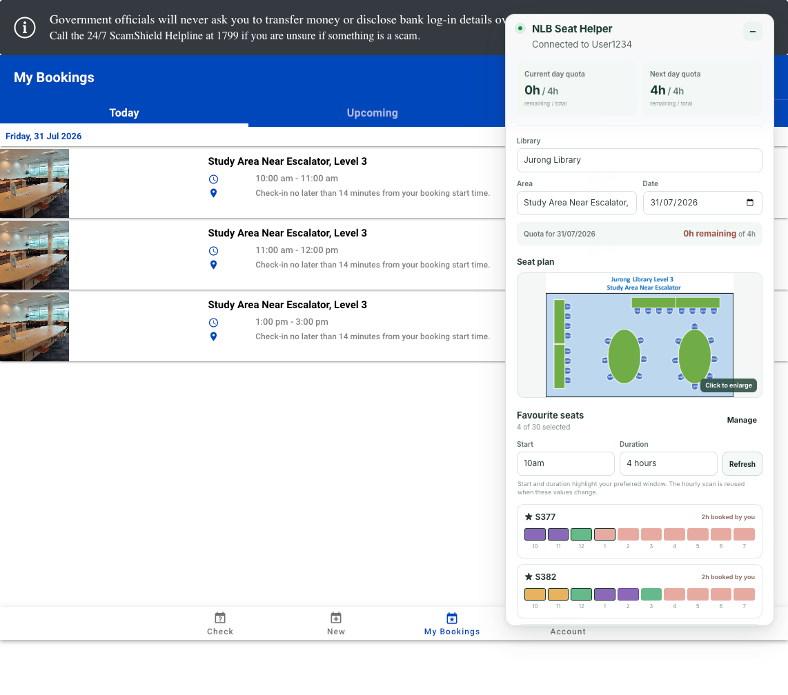

# NLB Seat Helper

A Chrome extension that makes it easier to book your favourite seats on the [NLB Seat Booking](https://www.nlb.gov.sg/seatbooking/)
website. It runs inside the existing NLB page and uses the tab's signed-in
session.

## At a glance

- Save your favourite seats and easily check their availability for the selected date.
- Cleaner UI/UX to browse the seat plan on the same page.
- Book multiple seats and time slots together, such as 10am-12pm and
  2pm-4pm.



## Install the latest release

No Node.js or development tools are required.

1. Open the
   [latest NLB Seat Helper release](https://github.com/teamcmcbot/nlb-seat-booking-extension/releases/latest).
2. Expand **Assets** and download **`nlb-seat-helper.zip`**.
   Do not download GitHub's automatically generated **Source code** archives.
3. Extract the ZIP to a permanent folder.
4. Open `chrome://extensions` in Chrome.
5. Enable **Developer mode**.
6. Select **Load unpacked**.
7. Choose the extracted folder that directly contains `manifest.json`.
8. Sign in to NLB and open or refresh
   `https://www.nlb.gov.sg/seatbooking/`.

Chrome requires Developer mode because this extension is distributed outside
the Chrome Web Store.

### Update an installed release

1. Download and extract the newest `nlb-seat-helper.zip`.
2. Replace the files inside the same permanent extension folder used during
   installation.
3. Open `chrome://extensions` and click **Reload** on NLB Seat Helper.
4. Refresh the NLB Seat Booking tab.

Keeping the same installation folder avoids creating a separate unpacked
installation and preserves the extension's existing Chrome storage.

## Features

### Account and quota

- Shows the signed-in NLB user ID in the compact panel header.
- Refreshes the signed-in account from the header after login without
  reloading the NLB page.
- Shows remaining versus total Study Area quota for the selected date.
- Refreshes account quota and booking information after a booking run.
- Formats quota in hours and minutes, including `0h` when exhausted.

### Libraries, areas, dates, and times

- Extracts the current library, area, seat, and booking rules from NLB's
  `GetAccountInfo` response.
- Excludes `facilityId: 2` discussion rooms and breakout rooms.
- Remembers the last selected library and area in Chrome storage.
- Respects NLB's configured advance-booking days and release time.
- Uses each area's opening time, closing time, booking interval, and minimum
  and maximum booking durations.
- Removes elapsed same-day slots. For example, at 12pm only slots beginning
  after 12pm are displayed and checked.

### Favourite seats and seat plan

- Stores favourite seats per area in Chrome storage.
- Provides seat-number search so large areas do not need to render every seat.
- Keeps the seat plan visible while favourite seats are browsed or managed.
- Prioritizes seats booked by the user and available seats after a scan, while
  keeping rows stationary as timeline cells are selected.
- Grows to fit short favourite lists, uses up to the remaining browser height
  for longer lists, and scrolls only that list when more seats are available
  than can fit.
- Displays NLB's seat-plan image when available, preferring the `-sp` map.
- Opens the seat plan in a full-screen viewer when clicked.

### Availability

- Checks availability only when **Check** or **Refresh** is
  clicked; there is no automatic availability refresh.
- Calls NLB's `SearchAvailableAreas` once per currently bookable interval.
- Runs requests sequentially to reduce load on the NLB service.
- Stops an individual request after six seconds.
- Retries a transient `429` or `5xx` response once after a short delay.
- Keeps successful interval results when another interval fails and marks the
  scan as incomplete.
- Extracts NLB's internal seat code from the availability response for use by
  the booking endpoint.

Timeline colors:

- Green: available and selectable.
- Blue with a check mark: selected for a new booking.
- Purple: already booked by the signed-in user.
- Amber: available, but blocked by another booking at the same time.
- Red: unavailable.

### Booking

- Limits selected intervals to the remaining quota for the selected date.
- Prevents selecting multiple seats for overlapping times.
- Prevents selecting times that overlap an active existing booking.
- Ignores canceled bookings such as `AutoPartialCancel` when checking
  conflicts.
- Supports selections across different favourite seats and non-consecutive
  times.
- Can combine adjacent intervals for the same seat into a continuous booking
  or submit every interval separately.
- Opens an immediate confirmation overlay with the seat and time summary before
  any booking requests are sent.
- Sends confirmed requests sequentially to NLB's `bookings/Book` endpoint.
- Displays pending, booking, successful, and failed status for every request.
- Lets users dismiss completed booking status manually and automatically clears
  an entirely successful run after 12 seconds. Failed results remain visible.

## Privacy and permissions

The extension requests only Chrome's `storage` permission.

It does not request cookie permissions or read browser cookies directly.
Requests use the NLB page's existing signed-in session with
`credentials: "include"`.

Chrome storage contains only:

- favourite seat selections; and
- the last selected library and area.

Account details, quotas, bookings, and availability results remain in memory
and are not persisted by the extension.

## Requirements

- Google Chrome or another Chromium browser that supports Manifest V3.
- An active NLB account session on the NLB Seat Booking website.
- Node.js and npm only when building from source.

## Build from source

Install dependencies and create the production extension:

```bash
npm install
npm run build
```

The unpacked extension is generated in `dist/`.

Available scripts:

```bash
npm run typecheck  # TypeScript validation
npm run build      # Typecheck and create a production build
npm run dev        # Rebuild dist/ whenever source files change
npm run package    # Build and create nlb-seat-helper.zip
```

`npm run dev` is optional. A completed `npm run build` produces a working
extension without a development process running.

## Load a development build in Chrome

1. Open `chrome://extensions`.
2. Enable **Developer mode**.
3. Select **Load unpacked**.
4. Choose this project's `dist` directory.
5. Open or refresh `https://www.nlb.gov.sg/seatbooking/`.

After rebuilding:

1. Click **Reload** for NLB Seat Helper on `chrome://extensions`.
2. Refresh the NLB Seat Booking tab.

Maintainers can follow
[Creating a GitHub Release](docs/releasing.md) to package and publish a
versioned download.

## Technical documentation

- [NLB Seat Booking API Notes](docs/nlb-api.md) documents every endpoint used
  by the extension, request parameters and bodies, consumed response schemas,
  sanitized JSON, field-level usage, and observed booking lifecycle behavior.
- [Extension Architecture and Behavior](docs/extension-architecture.md)
  explains catalog normalization, date and interval rules, availability
  scans, seat matching, conflict handling, booking plans, persistence, and
  failure behavior.
- [Holiday and Early-Closure Testing](docs/holiday-and-closure-testing.md)
  tracks the fields, unknowns, and live tests needed for special operating
  days.

## Usage

1. Sign in to NLB and open the Seat Booking page.
2. Select a library, a specific area, and an available date.
3. Open **Manage** and choose favourite seats.
4. Click **Check** beside Favourite seats.
5. Select green intervals without exceeding the displayed quota.
6. Choose whether adjacent intervals should be combined or booked separately.
7. Click **Book**, review the generated requests, and confirm.
8. Review the per-request booking status and refreshed quota.

## Project structure

```text
public/manifest.json          Manifest V3 extension definition
src/api/                      NLB account, availability, and booking requests
src/components/               Favourite-seat and booking interface
src/content/                  Injected application shell and styles
src/models/                   Normalized account, catalog, and booking types
src/services/                 Parsing, rules, persistence, conflicts, and plans
vite.config.ts                Content-script production build
```

## Compatibility note

This project integrates with the API responses and client-side rules used by
the current NLB Seat Booking website. NLB can change those endpoints or
response formats, so the extension may require updates when the website
changes.

Holiday closures, holiday-eve operating hours, branch exclusions, and
extended-hours areas still require live API verification. See
[Holiday and Early-Closure Testing](docs/holiday-and-closure-testing.md) for
the current behavior, known gaps, test matrix, and proposed acceptance
criteria.
