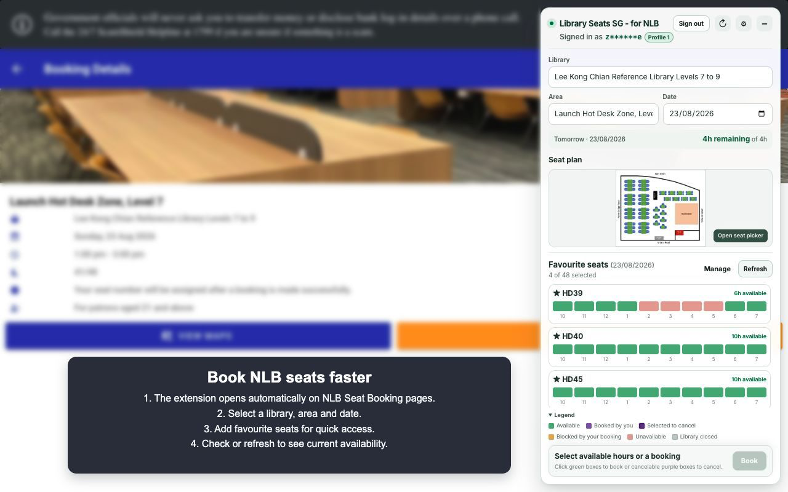
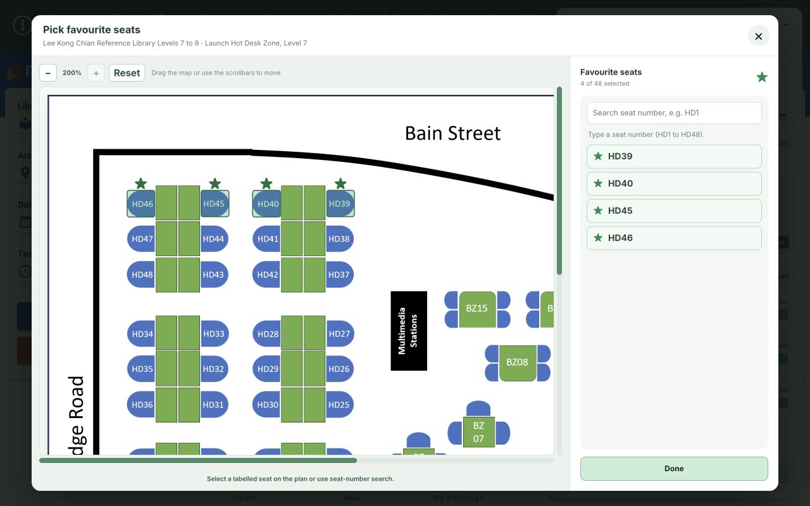

# Library Seats SG - for NLB

A free Chrome extension that makes it easier to find and manage library seats on
the [NLB Seat Booking](https://www.nlb.gov.sg/seatbooking/) website.

Save the seats you like, compare availability across the day, and review
bookings or cancellations in one clear workspace. You still sign in through
NLB, and NLB remains in control of every booking.

Library Seats SG is an independent project and is not affiliated with, endorsed
by, sponsored by, or supported by the National Library Board Singapore. "NLB"
is used only to identify the service with which the extension works.

By installing or using the extension, you agree to the [Terms of Use](TERMS.md).

## At a glance

- Save favourite seats separately for Guest and each NLB account you use.
- Compare a full day of availability without repeatedly opening individual
  seats.
- Search by seat number or use a reviewed interactive seat plan where one is
  available.
- Plan multiple non-overlapping seats and time blocks in one view.
- Review every booking or cancellation before anything is sent to NLB.

Library Seats SG is designed for students, working adults, senior citizens, and
other frequent library users who regularly book library seats and want a simpler
way to check their preferred places.





## Install

### Chrome Web Store

The public Chrome Web Store listing is being prepared and is not live yet. Its
install link will be added here after the trusted-tester release and Store
review are complete.

Installing the future Web Store version will create a separate Chrome
extension installation from the current unpacked version. Existing favourites
and settings will not transfer automatically.

### Install the current GitHub release manually

This advanced installation method requires Chrome Developer mode but does not
require Node.js or development tools.

1. Open the
   [latest Library Seats SG release](https://github.com/teamcmcbot/nlb-seat-booking-extension/releases/latest).
2. Expand **Assets** and download **`nlb-seat-helper.zip`**.
   Do not download GitHub's automatically generated **Source code** archives.
3. Extract the ZIP to a permanent folder.
4. Open `chrome://extensions` in Chrome.
5. Enable **Developer mode**.
6. Select **Load unpacked**.
7. Choose the extracted folder that directly contains `manifest.json`.
8. Open `https://www.nlb.gov.sg/seatbooking/` and use **Sign in** in the
   extension header if required.

Chrome requires Developer mode because this release is installed outside the
Chrome Web Store.

### Update an installed release

1. Download and extract the newest `nlb-seat-helper.zip`.
2. Replace the files inside the same permanent extension folder used during
   installation.
3. Open `chrome://extensions` and click **Reload** on Library Seats SG - for NLB.
4. Refresh the NLB Seat Booking tab.

Keeping the same installation folder avoids creating a separate unpacked
installation and preserves the extension's existing Chrome storage.

## Feature reference

See the [complete feature reference](docs/features.md) for account profiles,
Settings, favourite seats, seat plans, availability, booking safeguards, and
cancellation behavior.

See [Settings and local data](docs/settings.md) for a plain-language
explanation of every reset and deletion action, profile visibility, and safe
cleanup on a shared or public computer.

## Privacy and permissions

Read the complete [Privacy Policy](PRIVACY.md) for the information handled in
memory, stored locally, sent to NLB, retention, deletion, and contact details.

The extension requests only Chrome's `storage` permission.

It does not request cookie permissions or read browser cookies directly.
Requests use the NLB page's existing signed-in session with
`credentials: "include"`.

`chrome.storage.local` contains only:

- an installation-local random secret used to derive opaque account profile
  identifiers;
- the storage schema version, opaque local profile identifiers, their stable
  display order, and the last active local profile;
- favourite seat selections for each account;
- the last selected library and area for each account;
- each account's Guest-favourites copy decision and acknowledged Guest
  favourite identities;
- the installation's default adjacent-hour booking mode; and
- the local privacy/session disclosure acknowledgement.

The raw NLB user ID is used transiently in memory to associate the current NLB
session with its opaque local profile and create the masked on-screen label.
It is not written to Chrome storage or inserted into rendered markup. The
secret, opaque identifiers, and stored preferences never leave the browser
through extension code.

Other account details, quotas, bookings, and availability results remain in
memory and are not persisted by the extension.

## Requirements

- Google Chrome or another Chromium browser that supports Manifest V3.
- An NLB account when booking or using account-specific features.
- Node.js and npm only when building from source.

## Build from source

Install dependencies and create the production extension:

```bash
npm install
npm run build
```

The unpacked extension is generated in `dist/`.

Available scripts:

```bash
npm run typecheck  # TypeScript validation
npm test           # Run focused service regression tests
npm run build      # Typecheck and create a production build
npm run build:maintenance  # Create a visibly marked maintainer-only audit build
npm run dev        # Rebuild dist/ whenever source files change
npm run package    # Build and create nlb-seat-helper.zip
npm run seat-plans:capture  # Capture a candidate seat-plan baseline
npm run seat-plans:audit    # Compare a candidate with reviewed evidence
npm run seat-plans:full-audit  # Capture and generate JSON + HTML reports
npm run seat-plans:prepare  # Generate an ignored visual review packet
npm run seat-plans:prepare-drift  # Prepare all drifted annotation packets
npm run seat-plans:verify   # Verify definitions, baseline, and fingerprints
```

`npm run dev` is optional. A completed `npm run build` produces a working
extension without a development process running.

`npm run build:maintenance` is only for repository maintainers performing a
read-only seat-plan audit. Chrome labels this unpacked build **Library Seats SG -
for NLB (Maintenance)**; normal release builds do not expose the maintenance
controls.

## Load a development build in Chrome

1. Open `chrome://extensions`.
2. Enable **Developer mode**.
3. Select **Load unpacked**.
4. Choose this project's `dist` directory.
5. Open or refresh `https://www.nlb.gov.sg/seatbooking/`.

After rebuilding:

1. Click **Reload** for Library Seats SG - for NLB on `chrome://extensions`.
2. Refresh the NLB Seat Booking tab.

Maintainers can follow
[Creating a GitHub Release](docs/releasing.md) to package and publish a
versioned download.

## Technical documentation

- [Privacy Policy](PRIVACY.md) describes all information handled in memory,
  stored locally, or sent to NLB, together with retention and deletion.
- [Terms of Use](TERMS.md) explains user responsibilities, unofficial-service
  limitations, warranties, and liability boundaries.
- [MIT License](LICENSE) covers the project's original source code;
  [`NOTICE`](NOTICE) excludes NLB and other third-party marks and materials.
- [Third-Party Notices](THIRD_PARTY_NOTICES) records licences carried into the
  compiled release package by runtime dependencies.
- [Security Policy](SECURITY.md) provides a private reporting route and safe
  research boundaries that do not authorise testing NLB.
- [Feature Reference](docs/features.md) records the complete user-visible
  capability and safeguard inventory.
- [Settings and Local Data](docs/settings.md) explains profile visibility,
  reset and deletion controls, and shared-computer cleanup for users.
- [NLB Seat Booking API Notes](docs/nlb-api.md) documents every endpoint used
  by the extension, request parameters and bodies, consumed response schemas,
  sanitized JSON, field-level usage, and observed booking lifecycle behavior.
- [Extension Architecture and Behavior](docs/extension-architecture.md)
  explains catalog normalization, date and interval rules, availability
  scans, seat matching, conflict handling, booking plans, persistence, and
  failure behavior.
- [Holiday and Early-Closure Testing](docs/holiday-and-closure-testing.md)
  tracks the fields, unknowns, and live tests needed for special operating
  days.
- [Seat-plan Maintenance](docs/seat-plan-maintenance.md) documents sanitized
  catalog capture, the prerequisites for complete and agent-assisted audits,
  image fingerprints, drift auditing, overlays, and reviewed annotation
  updates.
- [Agent-run Seat-plan Audit](docs/seat-plan-agent-audit.md) provides the exact
  prerequisites and reusable prompts for a complete read-only audit and
  proposal-only annotation preparation.
- [Seat-plan Annotations](docs/seat-plan-annotations.md) documents runtime
  validation and the human-review rules for clickable hotspots.
- [Seat-plan Inventory](docs/seat-plan-inventory.md) is the generated
  point-in-time summary of reviewed areas, maps, fingerprints, and annotation
  status.
- [Chrome Web Store Publication Plan](docs/chrome-web-store-publication.md)
  records the public-release research, branding and privacy decisions, current
  account-storage behavior, Settings design, store copy, and staged
  implementation roadmap.
- [Chrome Web Store Privacy Declarations](docs/chrome-web-store-privacy-declarations.md)
  maps the current build to the Store's single-purpose, permission,
  user-data, Limited Use, and privacy-policy fields.
- [Chrome Web Store Submission Sheet](docs/chrome-web-store-submission.md)
  provides the ready-to-paste listing copy, public URLs, reviewer instructions,
  dashboard answers, and submission-time checklist.

## Usage

1. Open the Seat Booking page and sign in from the extension header.
2. Select a library, a specific area, and an available date.
3. Open **Manage** and choose favourite seats.
4. For today, review the immediately loaded matrix or click **Refresh**. If
   NLB's refreshed matrix is unusable, the extension explains that it is
   checking the remaining intervals individually. For a future date, click
   **Check** to run the same date-specific interval searches.
5. To book, select green intervals, choose the adjacent-hour mode, click
   **Book**, and confirm the request summary.
6. To cancel, select a cancelable purple booking, click **Cancel**, review the
   complete booking, choose a reason, and confirm.
7. Review the per-request result and automatically refreshed availability.

## Project structure

```text
public/manifest.json          Manifest V3 extension definition
LICENSE, NOTICE, TERMS.md     Project licence, rights notice, and user terms
PRIVACY.md, SECURITY.md       Public privacy and security policies
THIRD_PARTY_NOTICES           Runtime dependency licence notices
src/api/                      NLB account, availability, and booking requests
src/components/               Favourite-seat and booking interface
src/content/                  Injected application shell and styles
src/models/                   Normalized account, catalog, and booking types
src/services/                 Parsing, rules, persistence, conflicts, and plans
scripts/                      Packaging and seat-plan maintenance commands
docs/data/                    Reviewed machine-readable seat-plan baseline
vite.config.ts                Content-script production build
```

## Compatibility note

This project integrates with the API responses and client-side rules used by
the current NLB Seat Booking website. NLB can change those endpoints or
response formats, so the extension may require updates when the website
changes.

Full-day holiday closures are enforced from validated account settings.
Holiday-eve operating hours, non-empty branch exclusions, and extended-hours
areas still require additional live API verification. See
[Holiday and Early-Closure Testing](docs/holiday-and-closure-testing.md) for
the current behavior, known gaps, test matrix, and proposed acceptance
criteria.

Current-day availability normally uses the undated `GetAccountInfo` seat
matrix. Shortly after midnight, NLB was observed returning only an all-false
`01:00` entry for every seat, which matches no daytime timeline interval. The
extension rejects that placeholder and checks each remaining exact interval
through `SearchAvailableAreas`. `SearchSeatAvailability` is not used because
it showed the same overnight placeholder in a same-window comparison.
