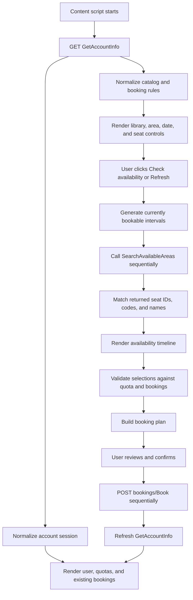

# Extension Architecture and Behavior

This document explains how NLB Seat Helper turns NLB's account/catalog data
into the favourite-seat availability and booking interface.

For endpoint-level request, response, field, and lifecycle documentation, see
[`nlb-api.md`](nlb-api.md).

## Runtime model

NLB Seat Helper is a Manifest V3 content-script extension. Chrome injects its
JavaScript and CSS only on:

```text
https://www.nlb.gov.sg/seatbooking/*
```

The React application renders an independent floating panel over the NLB page.
It does not replace or modify NLB's own booking controls.

The extension has one Chrome permission:

```json
{
  "permissions": ["storage"]
}
```

NLB requests run in the page's signed-in context with
`credentials: "include"`. No cookie API permission is requested.

## End-to-end flow



## Source responsibilities

| Location | Responsibility |
| --- | --- |
| `src/api/account.ts` | Fetches account/catalog JSON and classifies HTTP/session errors. |
| `src/api/availability.ts` | Builds one availability query, applies a six-second timeout, and returns unknown JSON for defensive parsing. |
| `src/api/booking.ts` | Sends one booking request and interprets the minimal success/error contract. |
| `src/services/catalog.ts` | Extracts, merges, filters, and sorts branches, areas, seats, maps, and booking rules. |
| `src/services/accountSession.ts` | Normalizes user ID, quota, advanced quota, and existing bookings. |
| `src/services/availability.ts` | Generates intervals and recursively extracts available seat identities and map URLs. |
| `src/services/bookingRules.ts` | Calculates dates, elapsed same-day intervals, durations, and preferred quota-based duration. |
| `src/services/bookingConflicts.ts` | Detects time overlap and identifies a signed-in user's seat booking. |
| `src/services/bookingPlanner.ts` | Produces separate requests or merges adjacent intervals for the same seat. |
| `src/services/favourites.ts` | Persists favourite seat identities in Chrome local storage. |
| `src/services/preferences.ts` | Persists the last selected branch and area. |
| `src/components/SeatAssistant.tsx` | Coordinates selection, scanning, booking, progress, and the interactive UI. |
| `src/content/App.tsx` | Owns account loading, top-level status, quota summary, and silent refresh. |

## Account and catalog normalization

`GetAccountInfo` is accepted as `unknown` rather than cast directly to a rigid
server type. The parsers validate individual values and ignore malformed or
unneeded fields.

Catalog extraction recursively searches the response for area collections.
This tolerates duplicated or differently nested catalog data. Areas with the
same `{branchId}:{areaId}` identity are merged, preferring the richer record.

During normalization:

- numeric and string IDs become strings;
- duplicate seats are removed;
- seats are sorted using numeric-aware name comparison;
- duplicate map URLs are removed;
- missing interval/minimum/maximum values default to 60/60/240 minutes;
- `facilityId: 2` areas are discarded; and
- area names and metadata are grouped under normalized branches.

This defensive approach improves compatibility but does not make arbitrary API
changes safe. Required area IDs, names, branch IDs, or seat IDs/names must
still be present.

## Date calculation

The date selector uses:

- the local Singapore/browser date;
- `advanceBookingDays`;
- the applicable booking release time;
- the area's normal closing time; and
- the area's minimum booking duration.

For today, the extension calculates the last possible booking start as:

```text
closing time - minimum booking duration
```

Once the current time reaches that boundary, today is removed from the date
range.

Before the configured release time, the furthest advanced date is reduced by
one day. If `allowAdvanceBooking` is true and a privileged release time exists,
that release time is used.

For the observed normal-account configuration:

```text
advanceBookingDays = 1
bookingReleaseTime = 12:00
allowAdvanceBooking = false
```

the resulting maximum date is:

```text
before 12:00  -> today
at/after 12:00 -> tomorrow
```

This is why the calendar appears to unlock tomorrow at noon. It is not a
hardcoded UI timer: the component keeps its current time state updated and
recalculates the date range from the latest NLB configuration. A privileged
account can use `privilegeUserBookingReleaseTime` instead.

Dates are calendar dates. The current implementation does not yet adjust the
range for holidays.

## Interval generation

Intervals start at `openingTime`, advance by
`bookingTimeslotInMinutes`, and are included only when a complete interval
ends at or before `closingTime`.

For a 10:00–20:30 area with 60-minute intervals:

```text
10:00, 11:00, 12:00, 13:00, 14:00,
15:00, 16:00, 17:00, 18:00, 19:00
```

The unused final 30 minutes cannot form a complete interval.

When the selected date is today, a start must be strictly later than the
current time. At 12:00 or 12:30, the first generated interval is 13:00.

## Favourite-seat management

Favourites are stored per branch and area as:

```ts
interface FavouriteSeat {
  branchId: string;
  areaId: string;
  seatId: string;
  seatCode: string;
  seatName: string;
}
```

Only matching favourites appear for the selected area. Search prevents a
large area from rendering hundreds of seats simultaneously.

The seat-range hint is calculated from the current area:

- same-prefix numeric names: `S35 to S59`;
- same-stem letter suffixes: `S48A to S48O`;
- up to three missing values: `S38 to S101, excluding S84`; or
- a count-only fallback for mixed, reversed, duplicate, or unfamiliar names.

No library/area range is hardcoded.

## Availability scan

Availability is manual. Changing branch, area, date, Start, or Duration does
not start a background polling loop.

When the user clicks **Check availability** or **Refresh**:

1. The extension computes the remaining valid intervals.
2. It sends one `SearchAvailableAreas` request for each interval.
3. Requests run sequentially.
4. A transient `429`/`5xx` response is retried once.
5. Each request has a six-second timeout.
6. Successful seat identities are stored per interval.
7. Discovered booking seat codes and map URLs are retained in memory.
8. Failed intervals are marked incomplete and never selectable.

Start and Duration are visual preference controls. They highlight a preferred
window but reuse the hourly scan; changing them does not repeat the network
requests.

## Seat identity matching

A catalog seat can be matched by any normalized value available from:

- seat ID;
- seat code; or
- visible seat name.

The match is case-insensitive. The availability response is also the source of
the booking-ready seat code when the initial catalog does not include one.

A slot may look available but remain unbookable until that code is known. This
fail-closed rule prevents malformed booking requests.

## Existing-booking conflicts

An existing booking blocks a displayed slot when:

```text
bookingStart < slotEnd AND bookingEnd > slotStart
```

Only bookings marked active by the account parser participate. Currently,
`lastAction` values containing `cancel` are inactive; all other values,
including a stale `Book`, are active.

The UI distinguishes:

- the exact seat and interval booked by the user;
- a different available seat blocked because the user already has an
  overlapping booking; and
- an ordinarily unavailable seat.

Location matching uses branch ID, seat name, facility, floor, and a normalized
area-name comparison. Facility/floor provide a strong fallback when NLB uses
slightly different area labels between catalog and booking records.

## Selection validation

A green cell is selectable only when:

- its availability request succeeded;
- the seat was returned as available;
- its booking seat code is known;
- no active existing booking overlaps it;
- no newly selected seat already occupies the same interval; and
- the total selected minutes do not exceed the selected date's remaining
  Study Area quota.

Selected cells are stored as `{seatId}|{slotStart}` keys.

## Booking plan

The review step converts selected cells into planned requests.

With **Book each hour separately**, every cell becomes a request:

```text
S377 11:00–12:00
S377 12:00–13:00
```

With **Combine adjacent hours**, consecutive cells merge only when:

- they belong to the same seat;
- the next starts exactly when the previous plan item ends; and
- the merged duration does not exceed the area's maximum booking duration.

Non-consecutive intervals and different seats always remain separate:

```text
S377 11:00–13:00
S377 17:00–19:00
```

## Booking execution and refresh

After explicit confirmation, the extension:

1. marks every planned request pending;
2. submits requests sequentially;
3. displays booking/booked/failed state for each request;
4. continues after an individual failure; and
5. fetches `GetAccountInfo` again after the run.

The refresh updates quota and booking conflicts in memory. It does not persist
account data to Chrome storage.

## State and persistence

Persisted in `chrome.storage.local`:

- favourite seats; and
- last selected branch and area.

Kept only in memory:

- account identity;
- quotas;
- existing bookings;
- availability results;
- discovered booking seat codes;
- map URLs;
- selected cells; and
- booking progress.

Reloading the NLB tab discards the in-memory state and fetches fresh account
data.

## Failure model

The extension favors safe false negatives over unsafe false positives:

- malformed catalog records are ignored;
- uncertain dates may remain unavailable;
- failed availability intervals cannot be selected;
- missing seat codes prevent booking;
- stale non-canceled bookings continue to block overlaps;
- quota limits are enforced client-side and still validated by NLB; and
- the final booking endpoint remains authoritative.

Client-side checks improve UX but are not security or concurrency guarantees.
Seat availability and quota can change between scan and booking.

## Known limitations

- No confirmed date-specific holiday/early-closure calculation.
- No authoritative raw availability-response fixture in the repository.
- No complete booking-response schema.
- `lastAction` cancellation detection is string-based.
- Check-in, cancellation, and extension buttons are not implemented.
- The extension cannot correct a delayed or stale NLB booking lifecycle state.
- Unpacked distribution requires Chrome Developer mode.

See [`holiday-and-closure-testing.md`](holiday-and-closure-testing.md) and the
booking lifecycle section of [`nlb-api.md`](nlb-api.md) for investigation
notes.
