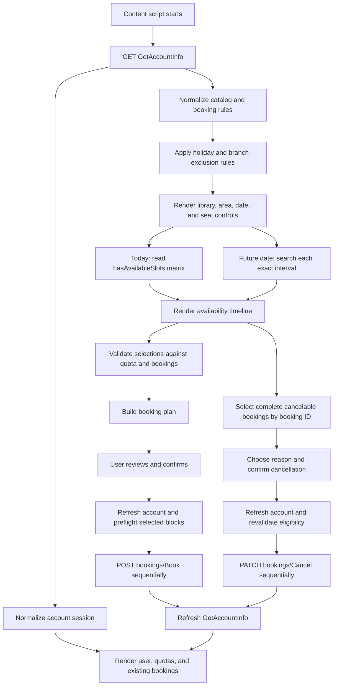

# Extension Architecture and Behavior

This document explains how NLB Seat Helper turns NLB's account/catalog data
into the favourite-seat availability and booking interface.

For endpoint-level request, response, field, and lifecycle documentation, see
[`nlb-api.md`](nlb-api.md).

## Runtime model

NLB Seat Helper is a Manifest V3 content-script extension. Chrome injects its
JavaScript and CSS only on:

```text
https://www.nlb.gov.sg/seatbooking/*
```

The React application renders an independent floating panel over the NLB page.
It does not replace or modify NLB's own booking controls.

The compact panel keeps the selected-date quota, seat plan, favourite
timelines, and booking action visible together. Short lists keep the panel at
its natural content height. Longer favourite lists expand up to the browser
height that remains after the fixed controls, then become the primary scroll
region so the map remains available while seats are browsed or managed.

Clicking the seat-plan preview opens a temporary full-screen seat picker. It
keeps the enlarged NLB plan beside the existing searchable favourite-seat
controls and writes through the same per-account favourite storage. Closing
the picker returns focus to the compact panel; the compact panel itself stays
at its normal width. The picker renders the verified plan and hotspots in a
scrollable viewport with 100%, 125%, 150%, 175%, and 200% zoom levels. Its
scrollbar tracks sit outside the map, and the map background supports mouse or
touch drag-to-pan in addition to trackpad and wheel scrolling. Clicking a seat
in the sidebar centers that seat in the viewport; clicking an annotated seat
on the map toggles the same favourite state. The timeline's expandable
**Legend** explains the availability and booking colors.

Verified seat-plan definitions can add interactive hotspots over an exact map
revision. Definitions use source-image coordinates and resolve each annotated
seat name to exactly one current catalog seat before calling the normal
favourite toggle. The exact fetched bytes are hashed with Web Crypto and
rendered from the same in-memory blob. The complete clickable layer is
disabled if the branch, area, map revision, image dimensions, SHA-256, seat
identity, geometry, or declared coverage does not validate. Unmapped and
rejected plans remain visible and retain seat-number search as the fallback.
Hotspots indicate favourite status
only; they do not represent date-specific availability. Reviewed range and
hybrid plans carry a `mappingBasis` marker and tell the user that positions
follow the printed endpoint and arrow order; these assignments are static and
revision-locked like individually labelled plans. See
[`seat-plan-annotations.md`](seat-plan-annotations.md) for the annotation and
review workflow.

The extension has one Chrome permission:

```json
{
  "permissions": ["storage"]
}
```

NLB requests run in the page's signed-in context with
`credentials: "include"`. No cookie API permission is requested.

## Authentication and account switching

The extension does not render an authentication form or handle NLB
credentials. **Sign in** invokes the Seat Booking page's own login control so
NLB creates and validates its authorization state. The content script is not
injected on `signin.nlb.gov.sg`, so the extension disappears while the user
completes NLB's official login flow.

Before invoking that control, the extension stores a short-lived sign-in
marker in the Seat Booking tab's session storage. After NLB redirects to the
Seat Booking page, the newly injected extension retries `GetAccountInfo` for a
bounded period while NLB finishes establishing the application session. The
panel then opens with the authenticated account without requiring a manual
refresh.

**Sign out** first sends `POST /seatbooking/api/logout`, then navigates to
NLB's central OIDC logout endpoint with the Seat Booking page as its return
service. This clears both the application and central sign-in sessions before
returning to the booking page.

Only one NLB account can be authenticated in a Chrome profile at a time.
Favourite seats and the last library/area selection are therefore stored
separately by `userId`, allowing users to sign out, sign in with another
account, and recover that account's preferences. Passwords, cookies,
authorization codes, quotas, and bookings are never persisted.

When signed out, catalog and availability features remain available. The
workspace uses the last active account's local favourites and area preference
until another account signs in.

## End-to-end flow



## Source responsibilities

| Location | Responsibility |
| --- | --- |
| `src/api/account.ts` | Fetches account/catalog JSON and classifies HTTP/session errors. |
| `src/api/availability.ts` | Builds one availability query, applies a six-second timeout, and returns unknown JSON for defensive parsing. |
| `src/api/booking.ts` | Sends one booking request and interprets the minimal success/error contract. |
| `src/api/cancellation.ts` | Cancels one complete booking without automatic retry. |
| `src/services/catalog.ts` | Extracts, merges, filters, and sorts branches, areas, seats, maps, and booking rules. |
| `src/services/accountSession.ts` | Normalizes user ID, quota, advanced quota, and existing bookings. |
| `src/services/availability.ts` | Generates intervals and recursively extracts available seat identities and map URLs. |
| `src/services/bookingRules.ts` | Calculates selectable dates and removes elapsed same-day intervals. |
| `src/services/bookingConflicts.ts` | Detects overlap, resolves bookings to catalog seats, and evaluates cancellation eligibility. |
| `src/services/bookingPlanner.ts` | Produces separate requests or merges adjacent intervals for the same seat. |
| `src/services/favourites.ts` | Persists favourite seat identities in Chrome local storage. |
| `src/services/seatPlanAnnotations.ts` | Matches exact map revisions and validates annotated hotspots against current catalog seats. |
| `src/data/seatPlans/` | Stores reviewed, non-account-specific seat-plan coordinates. |
| `src/components/ClickableSeatPlan.tsx` | Renders verified keyboard- and pointer-accessible favourite hotspots over a plan. |
| `docs/data/seat-plan-baseline.json` | Stores the point-in-time normalized catalog, map metadata, and SHA-256 evidence. |
| `scripts/seat-plan-*.mjs` | Captures, audits, verifies, and prepares annotation maintenance evidence. |
| `src/services/preferences.ts` | Persists the last selected branch and area. |
| `src/components/SeatAssistant.tsx` | Coordinates selection, scanning, booking, progress, and the interactive UI. |
| `src/content/App.tsx` | Owns account loading, top-level status, quota summary, and silent refresh. |

## Account and catalog normalization

`GetAccountInfo` is accepted as `unknown` rather than cast directly to a rigid
server type. The parsers validate individual values and ignore malformed or
unneeded fields.

For seat-plan maintenance, `SeatAssistant` registers a dormant custom export
event without altering the NLB URL or making an extra request. Dispatching the
event from DevTools requires confirmation before downloading the normalized
branch, area, seat identity, disabled state, map URL, and exact-area discovered
seat-code fields needed by the audit scripts. The export excludes the account
session, user ID, bookings, quotas, availability slots, and all raw server
payloads.

The optional `discoverMaps: true` event detail requires a second confirmation.
It deliberately awaits one exact-area `SearchAvailableAreas` probe at a time,
records per-area success or failure, and merges observed map URLs and booking
seat codes into the sanitized export. Those interval-scoped seat results are
metadata enrichment only and never become evidence that an absent seat was
removed from the catalog.

Catalog extraction recursively searches the response for area collections.
This tolerates duplicated or differently nested catalog data. Areas with the
same `{branchId}:{areaId}` identity are merged, preferring the richer record.

During normalization:

- numeric and string IDs become strings;
- duplicate seats are removed;
- seats are sorted using numeric-aware name comparison;
- duplicate map URLs are removed;
- missing interval/minimum/maximum values default to 60/60/240 minutes;
- `facilityId: 2` areas are discarded; and
- area names and metadata are grouped under normalized branches.

This defensive approach improves compatibility but does not make arbitrary API
changes safe. Required area IDs, names, branch IDs, or seat IDs/names must
still be present.

## Date calculation

The date selector uses:

- the local Singapore/browser date;
- `advanceBookingDays`;
- the applicable booking release time;
- the area's normal closing time; and
- the area's minimum booking duration; and
- validated inclusive `settings.holidays` date ranges and branch exclusions.

For today, the extension calculates the last possible booking start as:

```text
closing time - minimum booking duration
```

Once the current time reaches that boundary, today is removed from the date
range.

Before the configured release time, the furthest advanced date is reduced by
one day. If `allowAdvanceBooking` is true and a privileged release time exists,
that release time is used.

For the observed normal-account configuration:

```text
advanceBookingDays = 1
bookingReleaseTime = 12:00
allowAdvanceBooking = false
```

the resulting maximum date is:

```text
before 12:00  -> today
at/after 12:00 -> tomorrow
```

This is why the calendar appears to unlock tomorrow at noon. It is not a
hardcoded UI timer: the component keeps its current time state updated and
recalculates the date range from the latest NLB configuration. A privileged
account can use `privilegeUserBookingReleaseTime` instead.

Dates are calendar dates. A holiday `startTime` and `endTime` are normalized
to their local `YYYY-MM-DD` portions and treated as an inclusive range of full
closed days. A branch remains open only when its ID or code appears in that
holiday's `excludedBranches` list.

Closed dates remain selectable within the already released calendar-day range;
they do not extend `advanceBookingDays`. Before noon on a closed day, for
example, today remains selectable for inspection while tomorrow remains
unreleased. Holiday intervals render as grey, non-interactive cells rather
than green availability, including when the current-day matrix incorrectly
reports seats as available.

The holiday timestamps are not interpreted as special-day operating hours.
Early closures remain dependent on date-specific NLB availability until a
separate time-specific contract is observed and verified.

## Interval generation

Intervals start at `openingTime`, advance by
`bookingTimeslotInMinutes`, and are included only when a complete interval
ends at or before `closingTime`.

For a 10:00–20:30 area with 60-minute intervals:

```text
10:00, 11:00, 12:00, 13:00, 14:00,
15:00, 16:00, 17:00, 18:00, 19:00
```

The unused final 30 minutes cannot form a complete interval.

When the selected date is today, a start must be strictly later than the
current time. At 12:00 or 12:30, the first generated interval is 13:00.

## Favourite-seat management

Favourites are stored per branch and area as:

```ts
interface FavouriteSeat {
  branchId: string;
  areaId: string;
  seatId: string;
  seatCode: string;
  seatName: string;
}
```

Only matching favourites appear for the selected area. Search prevents a
large area from rendering hundreds of seats simultaneously.

Active bookings whose end time is still in the future are resolved against
the catalog using branch, area, facility, floor, and seat metadata. A unique
match is added to that account's persisted favourites when missing. This
allows purple booked seats to appear even when the user did not favourite them
manually. Ambiguous or unmatched bookings are reported and are never attached
to a guessed seat. An automatically added seat remains a normal favourite
after cancellation.

The seat-range hint is calculated from the current area:

- same-prefix numeric names: `S35 to S59`;
- same-stem letter suffixes: `S48A to S48O`;
- up to three missing values: `S38 to S101, excluding S84`; or
- a count-only fallback for mixed, reversed, duplicate, or unfamiliar names.

No library/area range is hardcoded.

## Availability scan

For today, availability initializes immediately from each catalog seat's
`hasAvailableSlots` matrix returned by `GetAccountInfo`. Pressing **Refresh**
fetches `GetAccountInfo` once and replaces the current-day matrix. An
`availableSeats` result from `SearchAvailableAreas` never upgrades a false
matrix value to true.

Before the matrix is rendered, a matching holiday closes the selected branch
for the entire date. Normal timeline intervals are retained for display, but
the extension creates an all-false closed matrix, skips map discovery and
availability scans, and renders non-interactive grey cells. An incorrect
all-available matrix therefore cannot override the closure. The account
refresh immediately before booking checks the holiday again and aborts before
preflight if the closure is still present.

The matrix has time labels but no booking date. For a future date, the
extension therefore retains the date-specific flow:

1. It computes the remaining valid intervals.
2. It sends one `SearchAvailableAreas` request for each interval.
3. Requests run sequentially.
4. A transient `429`/`5xx` response is retried once.
5. Each request has a six-second timeout.
6. Failed intervals are marked incomplete and never selectable.

When an area with no map is selected, one exact availability request is used
to extract and cache `areaMapUrls`. Availability and seat identities from this
map-discovery request are ignored.

The timeline always represents every currently bookable interval for the
selected date. Users choose booking times directly from green timeline cells;
there is no separate Start or Duration preference.

## Seat identity matching

A catalog seat can be matched by any normalized value available from:

- seat ID;
- seat code; or
- visible seat name.

The match is case-insensitive. Missing booking-ready seat codes do not prevent
selection because exact preflight obtains the code before any booking request.

## Existing-booking conflicts

An existing booking blocks a displayed slot when:

```text
bookingStart < slotEnd AND bookingEnd > slotStart
```

Only bookings marked active by the account parser participate. Currently,
`lastAction` values containing `cancel` are inactive; all other values,
including a stale `Book`, are active.

The UI distinguishes:

- the exact seat and interval booked by the user;
- a different available seat blocked because the user already has an
  overlapping booking; and
- an ordinarily unavailable seat.

Purple is a booking overlay with higher display priority than the underlying
availability result. It is therefore applied identically over today's account
matrix and a future date's exact interval results, and can appear before a
future availability scan finishes.

Location matching uses branch ID, seat name, facility, floor, and a normalized
area-name comparison. Facility/floor provide a strong fallback when NLB uses
slightly different area labels between catalog and booking records.

## Selection validation

A green cell is selectable only when:

- today's reference matrix, or a future-date exact check, marks it available;
- no active existing booking overlaps it;
- no newly selected seat already occupies the same interval; and
- the total selected minutes do not exceed the selected date's remaining
  Study Area quota.

Selected cells are stored as `{seatId}|{slotStart}` keys.

Cancellation uses a separate set of stable booking-ID keys. Green booking
selections and purple cancellation selections cannot be mixed. Clicking a
cancelable purple cell selects its complete booking, so every visible interval
covered by the same booking ID receives the selected state. A 13:00–15:00
booking covers the 13:00 and 14:00 interval cells and produces one
cancellation request.

A purple booking is interactive only when it has an ID, `lastAction` is
exactly `Book`, `canCancelStatus` is true, and the current time is before its
start. Started and checked-in bookings remain purple but noninteractive.

## Booking plan

The review step converts selected cells into planned requests and presents
them in a focused confirmation overlay, so confirmation never appears below an
internally scrolled section.

After execution, booking results can be dismissed manually. A run where every
request succeeded clears automatically after 12 seconds; partial or complete
failures stay visible for review.

With **Book each hour separately**, every cell becomes a request:

```text
S377 11:00–12:00
S377 12:00–13:00
```

With **Combine adjacent hours**, consecutive cells merge only when:

- they belong to the same seat;
- the next starts exactly when the previous plan item ends; and
- the merged duration does not exceed the area's maximum booking duration.

Non-consecutive intervals and different seats always remain separate:

```text
S377 11:00–13:00
S377 17:00–19:00
```

## Booking execution and refresh

After explicit confirmation, the extension:

1. refreshes `GetAccountInfo` and verifies the signed-in account;
2. requires today's refreshed matrix to keep every selected interval true;
3. preflights each planned booking block with `SearchAvailableAreas`;
4. obtains the booking-ready seat code from the successful preflight;
5. submits requests sequentially;
6. displays booking/booked/failed state for each request; and
7. fetches `GetAccountInfo` again after the run; and
8. refreshes today's matrix or reruns the future-date interval scan.

Preflight is asymmetric: it can remove a selected interval that NLB no longer
returns, but it cannot turn a reference-matrix false value into an available
cell. The final `Book` response remains authoritative.

The refresh updates quota and booking conflicts in memory. It does not persist
account data to Chrome storage.

## Cancellation execution and refresh

The cancellation review lists each selected booking once, even when it spans
multiple timeline cells. Reasons come from
`settings.menus.cancelReasons`; `ChangeOfPlan` is selected by default when it
exists, and one reason applies to the run.

After explicit confirmation, the extension:

1. refreshes `GetAccountInfo` and verifies the signed-in account;
2. resolves every selected booking again by ID;
3. rechecks action, server cancelability, and future start time;
4. sends one `PATCH bookings/Cancel` request per complete booking,
   sequentially and without automatic retry;
5. refreshes `GetAccountInfo` again to reconcile accepted, failed, and
   uncertain results; and
6. refreshes today's matrix or reruns the future-date interval scan.

Before each request, the start-time rule is checked again in case a booking
begins during a multi-request run. A `2xx` response is provisional until the
refreshed account shows the booking missing or inactive. Partial failures stay
visible and failed or uncertain bookings remain selected for review. Only
bookings confirmed missing or inactive are cleared from the cancellation
selection. A completely successful result can clear automatically after
twelve seconds.

## State and persistence

Persisted in `chrome.storage.local`:

- the NLB user ID embedded in each account-specific storage key;
- favourite seats for each account; and
- the last selected branch and area for each account.

Kept only in memory:

- account identity;
- quotas;
- existing bookings;
- availability results;
- discovered booking seat codes;
- map URLs;
- selected cells; and
- selected cancellation booking IDs;
- booking progress; and
- cancellation progress and the selected reason.

Reloading the NLB tab discards the in-memory state and fetches fresh account
data.

The header refresh action fetches `GetAccountInfo` with HTTP caching disabled.
This lets the extension detect a newly signed-in session after NLB redirects
back to the booking page without requiring another full-page reload.

The content script also watches NLB's client-side route changes. A
`reload=true` query parameter on the Seat Booking home, account, booking
details, or my-bookings route restarts account loading. This refreshes session,
quota, and booking data even when the site changes routes without reloading the
document.

## Failure model

The extension favors safe false negatives over unsafe false positives:

- malformed catalog records are ignored;
- uncertain dates may remain unavailable;
- failed availability intervals cannot be selected;
- missing seat codes prevent submission unless preflight supplies one;
- stale non-canceled bookings continue to block overlaps;
- malformed, changed, started, or server-disabled bookings cannot be
  cancelled;
- cancellation requests are never retried automatically;
- quota limits are enforced client-side and still validated by NLB; and
- NLB's refreshed account, booking, and cancellation responses remain
  authoritative.

Client-side checks improve UX but are not security or concurrency guarantees.
Seat availability and quota can change between scan and booking.

## Known limitations

- No confirmed date-specific holiday/early-closure calculation.
- No authoritative raw availability-response fixture in the repository.
- No complete booking- or cancellation-response schema.
- `lastAction` cancellation detection is string-based.
- Check-in, ending an active session early, and booking extension are not
  implemented.
- The extension cannot correct a delayed or stale NLB booking lifecycle state.
- Unpacked distribution requires Chrome Developer mode.

See [`holiday-and-closure-testing.md`](holiday-and-closure-testing.md) and the
booking lifecycle section of [`nlb-api.md`](nlb-api.md) for investigation
notes.
